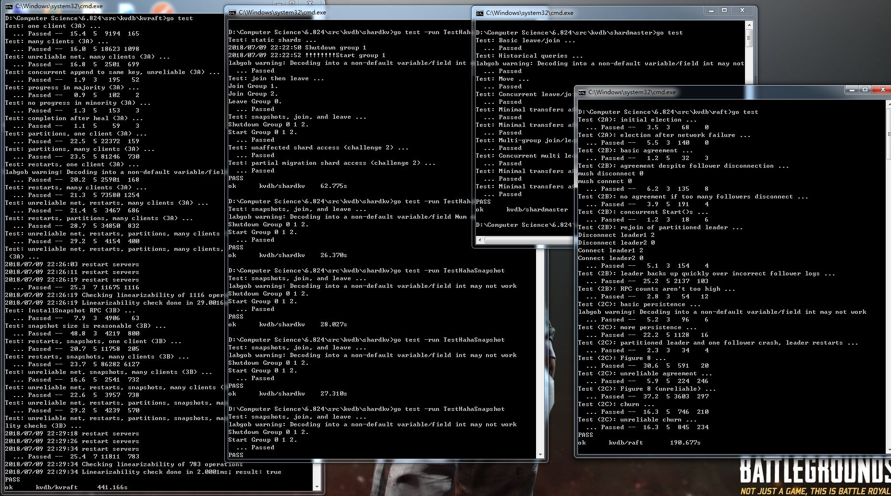

## a fault-tolerant key/value storage system. 

A replicated service achieves fault tolerance by storing complete copies of its state (i.e., data) on multiple replica servers. Replication allows the service to continue operating even if some of its servers experience failures (crashes or a broken or flaky network). The challenge is that failures may cause the replicas to hold differing copies of the data.

Raft manages a service's state replicas, and in particular it helps the service sort out what the correct state is after failures. Raft implements a replicated state machine. It organizes client requests into a sequence, called the log, and ensures that all the replicas agree on the contents of the log. Each replica executes the client requests in the log in the order they appear in the log, applying those requests to the replica's local copy of the service's state. Since all the live replicas see the same log contents, they all execute the same requests in the same order, and thus continue to have identical service state. If a server fails but later recovers, Raft takes care of bringing its log up to date. Raft will continue to operate as long as at least a majority of the servers are alive and can talk to each other. If there is no such majority, Raft will make no progress, but will pick up where it left off as soon as a majority can communicate again.

- [x] Lab 1: MapReduce

- [x] Lab 2: Raft

- [x] Lab 3: Fault-tolerant Key/Value Service
- [x] Part A Key/value service without log compaction
- [x] Part B Key/value service with log compaction

- [x] Lab 4: Sharded Key/Value Service
- [x] Part A: The Shard Master
- [x] Part B: Sharded Key/Value Server (Partial Pass)

pprof can check goroutine stacks at runtime
https://golang.org/pkg/net/http/pprof/

Lab3 B modify Raft and kvserver to cooperate to save space: from time to time kvserver will persistently store a "snapshot" of its current state, and Raft will discard log entries that precede the snapshot. When a server restarts (or falls far behind the leader and must catch up), the server first installs a snapshot and then replays log entries from after the point at which the snapshot was created. Section 7 of the extended Raft paper outlines the scheme.

### The snapshot flow:
* when kvraft reaches 95% threhold, save snapshot for keyValue Map, client request by uuid map
* When raft leaders found the next index to send for follower X is less than his snapshot index, it knows the next log entry to send is in snapshot, so leader sends an entire snapshot to that follower
* When follower gets the snapshot, save it(replace with current one)
* In each raft server local apply logic, if last applied index is less than snapshot, it needs to apply the snapshot it has, include the saved data to applyMsg, so the kvRaft app can get it
* when kvraft app gets it, load the data, save as keyValue Map, client request by uuid map
One iteration completed.